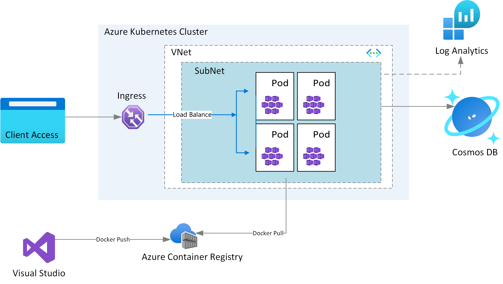
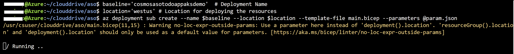
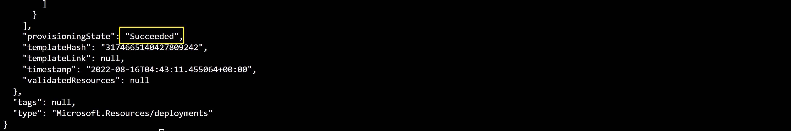
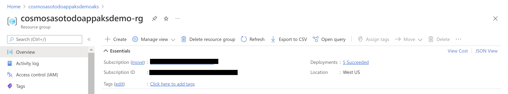

# Bicep and ASO to configure Cosmos DB sample ToDo App on AKS Cluster
## Overview

This repository explains on how to use modular approach for Infrastructure as Code to provision a AKS cluster and few related resources using [Bicep](https://docs.microsoft.com/azure/azure-resource-manager/bicep/overview?tabs=bicep) and [Azure Service Operators(ASO)](https://devblogs.microsoft.com/cse/2021/11/11/azure-service-operators-a-kubernetes-native-way-of-deploying-azure-resources/).
* The Bicep modules deploy the AKS infrastructure resources
* ASO deploys a Cosmos DB account along with a Database, and a Container


The Bicep modules will provision the following Azure resources.
1. A Resource Group
2. A Managed Identity
3. Azure Container Registry for storing images
4. A VNet required for configuring the AKS
5. A AKS Cluster

ASO will do the  following
1. Provision a Cosmos DB SQL API Account along with a Database, and a Container
2. Host the sample ToDo application

### Architecture



## Deploy Infrastructure with Bicep

**1. Clone the repository**

Clone the repository and move to ASO folder

```azurecli
cd ASO
```

**2. Login to your Azure Account**

```azurecli
az login

az account set -s <Subscription ID>
```


**3. Initialize Parmaters**

Create a param.json file by using the following JSON, replace the {Resource Group Name} and {ACR Instance Name} placeholders with your own values for Resource Group Name, and Azure Container Registry instance Name. Refer to [Naming rules and restrictions for Azure resources](https://docs.microsoft.com/azure/azure-resource-manager/management/resource-name-rules).

```json
{
  "$schema": "https://schema.management.azure.com/schemas/2019-04-01/deploymentParameters.json#",
  "contentVersion": "1.0.0.0",
  "parameters": {
    "rgName": {
      "value": "{Resource Group Name}"
    }, 
    "acrName" :{
      "value": "{ACR Instance Name}"
    }
  }
}
```

**4. Run Bicep Deployment**

In the below given script replace the {Resource Group Name} and {Location} placeholder with same values  that were supplied in param.json. Execute the following script to create the deployment

```azurecli
deploymentName='{Deployment Name}'  # Deployment Name
location='{Location}' # Location for deploying the resources

az deployment sub create --name $deploymentName --location $location --template-file main.bicep --parameters @param.json
```



The deployment could take somewhere around 20 to 30 mins. Once provisioning is completed you should see a JSON output with Succeeded as provisioning state.



You can also see the deployment status in the Resource Group



**5. Link Azure Container Registry with AKS**

Set the environment variables by replacing the {ACR Instance Name}, and {Resource Group Name} placeholders with the same values supplied in param.json.

```azurecli

acrName='{ACR Instance Name}'
rgName='{Resource Group Name}'
aksName=$rgName'aks'
miName=$rgName'identity'
```

Run the below command to integrate the ACR with the AKS cluster

```azurecli

az aks update -n $aksName -g $rgName --attach-acr $acrName
```

## Set up Azure Service Operator

**1. Sign in to AKS CLuster**

Use the below command to sign in to your AKS cluster. This command also downloads and configures the kubectl client certificate on your environment.

```azurecli
az aks get-credentials -n $aksName -g $rgName
```

**2. Install Azure Service Operator**

Follow [these instructions](https://github.com/Azure/azure-service-operator/tree/master/v2#installation) to install the ASO v2 operator in your cluster.

The ASO is installed in your cluster and propagates changes to resources there to the Azure Resource Manager.
[Read more about how ASO works](https://github.com/azure/azure-service-operator#what-is-it)


## Deploy Cosmos DB with ASO

ASO helps you provision Azure resources and connect your applications to them from within Kubernetes. If you want to use Azure resources but would prefer to manage those resources using Kubernetes tooling and primitives (for example kubectl apply).

The YAML template cosmos-sql-demo.yaml creates the following:

* A Kubernetes namespace named `my-app`
* An new Azure Resource Group (Although having services for the same workload in multiple resource groups is an anti-pattern. We recommend a new resource group here so that deleting the deployment doesn't remove the primary resource group along with all its contained resources)
* A Cosmos DB SQL API account, a database, and a container (equivalent to a table in the [Cosmos DB resource model](https://docs.microsoft.com/azure/cosmos-db/account-databases-containers-items))

Using the following YAML template create a cosmos-deploy-aso.yml file, update  the value for {Location} placeholder with the value supplied in previous steps. Replace the value for {Cosmos DB Account Name}, and {ASO Resource Group Name}, placeholders with your own values. Make sure the resource name are compliant with [Naming rules and restrictions for Azure resources](https://docs.microsoft.com/azure/azure-resource-manager/management/resource-name-rules)

```yml
apiVersion: v1
kind: Namespace
metadata:
  name: my-app
---
apiVersion: resources.azure.com/v1beta20200601
kind: ResourceGroup
metadata:
  name: {ASO Resource Group Name} 
  namespace: my-app
spec:
  location: {Location}
  azureName: {ASO Resource Group Name} 
---
apiVersion: documentdb.azure.com/v1beta20210515
kind: DatabaseAccount
metadata:
  name: {Cosmos DB Account Name}
  namespace: my-app
spec:
  location: {Location}  
  owner:
    name: {ASO Resource Group Name} 
  kind: GlobalDocumentDB
  databaseAccountOfferType: Standard
  locations:
    - locationName: {Location}
---
apiVersion: documentdb.azure.com/v1beta20210515
kind: SqlDatabase
metadata:
  name: todoapp
  namespace: my-app
spec:
  location: {Location}
  owner:
    name: {Cosmos DB Account Name}
  options:
    throughput: 400
  resource:
    id: todoapp
---
apiVersion: documentdb.azure.com/v1beta20210515
kind: SqlDatabaseContainer
metadata:
  name: tasks
  namespace: my-app
spec:
  location: {Location}
  owner:
    name: todoapp
  resource:
    id: tasks
    partitionKey:
      kind: Hash
      paths: ["/id"]
```

Execute the below command to create the Cosmos DB account, database and container.

```azurecli
kubectl apply -f cosmos-deploy-aso.yml 
```

The operator will start creating the Cosmos DB account, database, and container in Azure. You can monitor their progress with:

```azurecli

kubectl get -n my-app resourcegroup,databaseaccount,sqldatabase,sqldatabasecontainer
```

Repeat  the above command till all Cosmos DB resources are in ready state. It could take a few minutes for the Cosmos DB resources to be provisioned. In that time you might see some `ResourceNotFound` errors, or messages indicating that the database account isn't ready, on the SQL database or container. The operator will keep creating them once the account is available and the errors should eventually resolve themselves.

## Configure RBAC in Azure Cosmos DB

**1. Create a SQL role definition**

Using the following JSON template create a SQL role definition as explained [here](https://docs.microsoft.com/cli/azure/cosmosdb/sql/role/definition?view=azure-cli-latest#az-cosmosdb-sql-role-definition-create), save it as sql-role-definition.json. Remember to replace {SQL ROLE NAME} placeholder with your own value.

```json
{
    "RoleName": "{SQL ROLE NAME}",
    "Type": "CustomRole",
    "AssignableScopes": ["/"],
    "Permissions": [{
      "DataActions": [
        "Microsoft.DocumentDB/databaseAccounts/readMetadata",
       "Microsoft.DocumentDB/databaseAccounts/sqlDatabases/containers/executeQuery",
       "Microsoft.DocumentDB/databaseAccounts/sqlDatabases/containers/readChangeFeed",
       "Microsoft.DocumentDB/databaseAccounts/sqlDatabases/containers/items/read",
       "Microsoft.DocumentDB/databaseAccounts/sqlDatabases/containers/items/upsert",
       "Microsoft.DocumentDB/databaseAccounts/sqlDatabases/containers/items/create"
        ]
    }]
}
```

Execute the below command to create a SQL role definition under an Azure Cosmos DB account using the JSON file. Remember to replace the {ASO Resource Group Name},and {Cosmos DB Account Name} placeholders with the value supplied in cosmos-deploy-aso.yml.
```azurecli

asoRG={ASO Resource Group Name}
cosmosAccount={Cosmos DB Account Name}
az cosmosdb sql role definition create --resource-group $asoRG --account-name $cosmosAccount  --body @sql-role-definition.json
```

**2. Assignment of SQL Role in Cosmos DB**

Execute the below commands to create the SQL role assignment under the Azure Cosmos DB account. Remember to replace {SQL ROLE NAME}   placeholder with values provided in sql-role-definition.json.

```azurecli

sqlRoleName={SQL ROLE NAME}

cosmosResourceId=$(az cosmosdb show --resource-group $asoRG   --name $cosmosAccount  --query id  --output tsv)

miResourceId=$(az identity show --name $miName --resource-group $rgName --query id  --output tsv)
miPrincipal=$(az identity show --ids=$miResourceId  --query principalId  --output tsv)

az cosmosdb sql role assignment create --resource-group $asoRG  --account-name $cosmosAccount --role-definition-name $sqlRoleName --principal-id  $miPrincipal --scope $cosmosResourceId 
```

## Sample Application Deployment

**1. Push the container image to Azure Container Registry**

The application can be built and pushed to ACR using Visual Studio or VS Code. Use any of the two methods given below

**Using Visual Studio**

Prerequisites: 
* [Docker Desktop](https://docs.docker.com/desktop/)
* [Visual Studio 2022](https://visualstudio.microsoft.com/downloads) with the Web Development, Azure Tools workload, and/or .NET Core cross-platform development workload installed
* [.NET Core Development Tools](https://dotnet.microsoft.com/download/dotnet-core/) for development with .NET Core

Build the application source code available in the Application folder, and then [publish the container image to the ACR](https://docs.microsoft.com/visualstudio/containers/hosting-web-apps-in-docker?view=vs-2022).

**Using Visual Studio Code**

Prerequisites:
* [Docker Desktop](https://docs.docker.com/desktop/)
* [Visual Studio Code](https://code.visualstudio.com/)
* [C# for Visual Studio Code](https://marketplace.visualstudio.com/items?itemName=ms-dotnettools.csharp)
* [Docker extension for Visual Studio Code](https://code.visualstudio.com/docs/containers/overview)
* [Azure Account extension for Visual Studio Code](https://marketplace.visualstudio.com/items?itemName=ms-vscode.azure-account)

    1. To build the code, open the Application folder in VS code. Select Yes to the warning message to add the missing build and debug assets. Pressing the F5 button to run the application.

    2. To create a container image from the Explorer tab on VS Code, right click on the Dokcerfile and select BuildImage. You will then get a prompt asking for the name and version to tag the image. Type todo:latest.

        

    3. To push the built image to ACR open the Docker tab.You will find the built image under the Images node. Open the todo node, right-click on latest and select "Push...". You will then get prompts to select your Azure Subscription, ACR, and Image tag. Image tag format should be {acrname}.azurecr.io/todo:latest.

        

    4. Wait for VS Code  to push the  image to ACR.

**2. Create pod secrets**

Pod Secrets provides a mechanism to hold sensitive information in the AKS cluster and pass it to the pods. 

Using the following JSON template create a file called appsettings.secrets.json. Replace the {Cosmos DB Account Name} placeholder with your own value.

```json
{
    "CosmosEndpoint":  "https://{Cosmos DB Account Name}.documents.azure.com:443/" 
}

```

Execute the below command to create secrets that pods will use

```azurecli
kubectl create secret generic secret-appsettings --namespace 'my-app' --from-file=appsettings.secrets.json
```

**3. App Deployment YAML**

 Using the following YAML template create a akstodo-appdeploy.yml file, update your own values for {ACR Name}, {Image Name}, and {Version} placeholders.

```yml
apiVersion: apps/v1
kind: Deployment
metadata:
  name: todo
  labels:
    aadpodidbinding: "cosmostodo-apppodidentity"
    app: todo
spec:
  replicas: 2
  selector:
    matchLabels:
      app: todo
  template:
    metadata:
      labels:
        app: todo
        aadpodidbinding: "cosmostodo-apppodidentity"
    spec:
      containers:
      - name: mycontainer
        image: "{ACR Name}/{Image Name}:{Version}" # update as per your environment, example myacrname.azurecr.io/todo:latest. Do NOT add https:// in ACR Name
        ports:
        - containerPort: 80
        volumeMounts:
        - name: secrets
          mountPath: /app/secrets
          readOnly: true
      volumes:
      - name: secrets
        secret:
          secretName: secret-appsettings
---
    
kind: Service
apiVersion: v1
metadata:
  name: todo
spec:
  selector:
    app: todo
    aadpodidbinding: "cosmostodo-apppodidentity"    
  type: LoadBalancer
  ports:
  - protocol: TCP
    port: 80
    targetPort: 80
``` 


**4. Apply Deployment YAML**

The following command deploys the application pods and exposes the pods via a load balancer.

```azurecli
kubectl apply -f akstodo-appdeploy.yml --namespace 'my-app'
```

**5. Access the deployed application**

Run the following command to view the external IP exposed by the load balancer

```azurecli
kubectl get services --namespace "my-app"
```

Open the IP received as output in a browser to access the application.

## Securing the Cosmos DB Account

You can configure the Azure Cosmos DB account to:

1. Allow access only from a specific subnet of a virtual network (VNET) **or** make it accessible from any source.
2. Authorize request accompanied by a valid authorization token **or** restrict access using RBAC and Managed Identity.

This deployment uses the baseline configuration for Azure Cosmos DB account

1. To limit access to a subnet refer to [configuring a virtual network service endpoint](https://docs.microsoft.com/azure/cosmos-db/how-to-configure-vnet-service-endpoint).
2. Refer to [enforce RBAC as the only authentication method](https://docs.microsoft.com//azure/cosmos-db/how-to-setup-rbac#disable-local-auth) to set disableLocalAuth = true in the databaseAccount resource.
# Cleanup

When you're finished with the sample application you can clean all of the Kubernetes resources up by deleting the 'my-app' namespace in your cluster.

```azurecli
kubectl delete namespace my-app
```

Use the below commands to delete the Resource Groups and Deployment

```azurecli
az group delete -g $rgName -y
az group delete -g $asoRG' -y
az deployment sub delete -n $deploymentName
```
