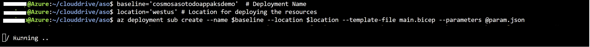
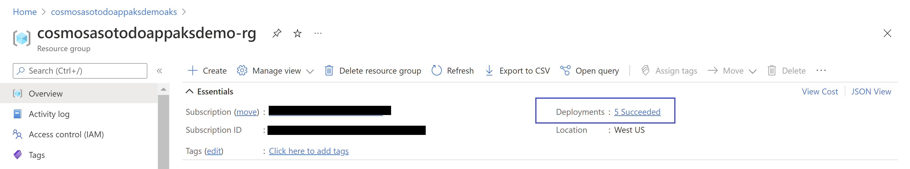

# Bicep and ASO to configure Cosmos DB sample ToDo App on AKS Cluster
## Overview

This repository explains on how to use modular approach for Infrastructure as Code to provision a AKS cluster and few related resources using [Bicep](https://docs.microsoft.com/en-us/azure/azure-resource-manager/bicep/overview?tabs=bicep) and [Azure Service Operators(ASO)](https://devblogs.microsoft.com/cse/2021/11/11/azure-service-operators-a-kubernetes-native-way-of-deploying-azure-resources/).
* The Bicep modules deploy the AKS infrastructure resources
* ASO deploys a Cosmos DB account along with a Database, and a Container


The Bicep modules will provision the following Azure resources.
1. A Resource Group with baseline variable
2. A Managed Identity
3. Azure Container Registry for storing images
4. A VNet required for configuring the AKS
5. A AKS Cluster

ASO will do the  following
1. Provision a Cosmos DB SQL API Account along with a Database, and a Container
2. Host the sample ToDo application

## Prerequisites
* Visual Studio 2019

## Deploy infrastructure with Bicep

**1. Clone the repository**

Clone the repository and move to ASO folder

```azurecli
cd ASO
```

**2. Login to your Azure Account**

```azurecli
az login

az account set -s <Subscription ID>
```


**3. Initialize Parmaters**

Create a param.json file by using the following JSON, replace the {Resource Group Name} and {ACR Instance Name} placeholders with your own values for Resource Group Name, and Azure Container Registry instance Name. Refer to [Naming rules and restrictions for Azure resources] (https://docs.microsoft.com/en-us/azure/azure-resource-manager/management/resource-name-rules). 

```json
{
  "$schema": "https://schema.management.azure.com/schemas/2019-04-01/deploymentParameters.json#",
  "contentVersion": "1.0.0.0",
  "parameters": {
    "baseName": {
      "value": "{Resource Group Name}"
    }, 
    "acrName" :{
      "value": "{ACR Instance Name}"
    }
  }
}
```

**4. Run Bicep Deployment**

In the below given script replace the {Resource Group Name} and {Location} placeholder with your own value. Make sure to use same value  for {Resource Group Name} as supplied in param.json above. Run the following script to create the deployment

```azurecli
baseline='{Resource Group Name}'  # Provide Resource Group Name, make sure it matches value in param.json
location='{Location}' # Provide Location for deploying the resources

az deployment sub create --name $baseline --location $location --template-file main.bicep --parameters @param.json
```



The deployment could take somewhere around 20 to 30 mins. Once provisioning is completed you should see a JSON output with Succeeded as provisioning state.


You can also see the deployment status in the Resource Group



**5. Link Azure Container Registry with AKS**

Integrate the ACR with the AKS cluster by supplying valid ACR name

```azurecli
# ensure the below value matches  the acrName field of param.json
acrName={ACR Instance Name} 

az aks update -n $baseline'aks' -g $baseline'-rg' --attach-acr $acrName
```

## Set up Azure Service Operator

**1. Sign in to AKS CLuster**

Use [az aks get-credentials][az-aks-get-credentials] to sign in to your AKS cluster. This command also downloads and configures the kubectl client certificate on your environment.

```azurecli
az aks get-credentials -n $baseline'aks' -g $baseline'-rg'
```

**2. Install Azure Service Operator**

Follow [these instructions](https://github.com/Azure/azure-service-operator/tree/master/v2#installation) to install the ASO v2 operator in your cluster.

The ASO is installed in your cluster and propagates changes to resources there to the Azure Resource Manager.
[Read more about how ASO works](https://github.com/azure/azure-service-operator#what-is-it)


## Deploy Cosmos DB with ASO

ASO helps you provision Azure resources and connect your applications to them from within Kubernetes. If you want to use Azure resources but would prefer to manage those resources using Kubernetes tooling and primitives (for example kubectl apply).

The YAML template cosmos-sql-demo.yaml creates the following:

* A Kubernetes namespace named `my-app`
* An Azure resource group
* A Cosmos DB SQL API account, a database, and a container (equivalent to a table in the [Cosmos DB resource model](https://docs.microsoft.com/en-us/azure/cosmos-db/account-databases-containers-items))

Execute the below command to apply the yaml and create the Cosmos DB Account and related resources. Make sure to update your own values by replacing the {Cosmos DB Account Name} placeholder.

```azurecli
cosmosAccount={Cosmos DB Account Name}
asoRG=$baseline'-aso-rg'

cat <<EOF | kubectl apply -f -
apiVersion: v1
kind: Namespace
metadata:
  name: 'my-app'
---
apiVersion: resources.azure.com/v1alpha1api20200601
kind: ResourceGroup
metadata:
  name: $asoRG
  namespace: 'my-app'
spec:
  location: $location
---
apiVersion: documentdb.azure.com/v1alpha1api20210515
kind: DatabaseAccount
metadata:
  name: $cosmosAccount
  namespace: 'my-app'
spec:
  location: $location
  owner:
    name: $asoRG
  kind: GlobalDocumentDB
  databaseAccountOfferType: Standard
  locations:
    - locationName: $location
---
apiVersion: documentdb.azure.com/v1alpha1api20210515
kind: SqlDatabase
metadata:
  name: todoapp
  namespace: 'my-app'
spec:
  location: $location
  owner:
    name: $cosmosAccount
  options:
    autoscaleSettings:
      maxThroughput: 4000
  resource:
    id: todoapp
---
apiVersion: documentdb.azure.com/v1alpha1api20210515
kind: SqlDatabaseContainer
metadata:
  name: tasks
  namespace: 'my-app'
spec:
  location: $location
  owner:
    name: todoapp
  resource:
    id: tasks
    partitionKey:
      kind: Hash
      paths: ["/id"]

EOF
```

The operator will start creating the Cosmos DB account, database, and container in Azure. You can monitor their progress with:

```azurecli

kubectl get -n my-app resourcegroup,databaseaccount,sqldatabase,sqldatabasecontainer
```

Repeat  the above command till all Cosmos DB resources are in ready state. It could take a few minutes for the Cosmos DB resources to be provisioned. In that time you might see some `ResourceNotFound` errors, or messages indicating that the database account isn't ready, on the SQL database or container. The operator will keep creating them once the account is available and the errors should eventually resolve themselves.

## Configure RBAC in Azure Cosmos DB

**1. Create a SQL role definition**

Use the following commands to create a SQL role definition as explained [here](https://docs.microsoft.com/en-us/cli/azure/cosmosdb/sql/role/definition?view=azure-cli-latest#az-cosmosdb-sql-role-definition-create). Remember to replace {GUID} and {SQL ROLE NAME} placeholders with your own values.


```azurecli

CosmosdbScope =$(az cosmosdb show --resource-group $asoRG   --name $cosmosAccount  --query id  --output tsv)

identityResourceId=$(az identity show --name $baseline'identity' --resource-group $baseline'-rg' --query id  --output tsv)
myIdentityPrincipal=$(az identity show --ids=$identityResourceId  --query principalId  --output tsv)
az cosmosdb sql role definition create --resource-group $asoRG --account-name $cosmosAccount  --body '{
    "Id": "{GUID}",
	  "RoleName": "{SQL ROLE NAME}",
    "Type": "CustomRole",
    "AssignableScopes": ["/"],
    "Permissions": [{
        "DataActions": [
            "Microsoft.DocumentDB/databaseAccounts/readMetadata",
			"Microsoft.DocumentDB/databaseAccounts/sqlDatabases/containers/executeQuery",
			"Microsoft.DocumentDB/databaseAccounts/sqlDatabases/containers/readChangeFeed",
			"Microsoft.DocumentDB/databaseAccounts/sqlDatabases/containers/items/read",
			"Microsoft.DocumentDB/databaseAccounts/sqlDatabases/containers/items/upsert",
			"Microsoft.DocumentDB/databaseAccounts/sqlDatabases/containers/items/create"
        ]
    }]
}'
```

**2. Assignment of SQL Role in Cosmos DB**

Create a SQL role assignment under an Azure Cosmos DB account using Role Definition Name

```azurecli
# Ensure Role Name matches with Role name provided in the previous step.

az cosmosdb sql role assignment create --resource-group $asoRG  --account-name $cosmosAccount --role-definition-name {SQL ROLE NAME} --principal-id  $myIdentityPrincipal --scope $CosmosdbScope 
```

## Sample Application deployment

**1. Push the container image to Azure Container Registry**

Using Visual Studio build the application source code available in the Application folder, [publish the container image to the ACR](https://docs.microsoft.com/en-us/visualstudio/containers/hosting-web-apps-in-docker?view=vs-2022). In case you are using a Mac please use [these steps](https://docs.microsoft.com/en-us/azure/developer/javascript/tutorial/tutorial-vscode-docker-node/tutorial-vscode-docker-node-04#build-a-docker-image) to publish the image to ACR

**2. Create pod secrets**

Pod Secrets provides a mechanism to hold sensitive information in the AKS cluster and pass it to the pods. 

Using the following JSON template nnd create a appsettings.secrets.json file. Replace the {Cosmos DB Account Name} placeholder with your own value.

```json
{
    "CosmosEndpoint":  "https://{Cosmos DB Account Name}.documents.azure.com:443/" 
}

```

Execute th below command to create secrets that pods will use

```azurecli
kubectl create secret generic secret-appsettings --namespace 'my-app' --from-file=appsettings.secrets.json
```

**3. App Deployment YAML**

 Using the following YAML template create a akstodo-appdeploy.yml file, update your own values for ACR Name, Image Name, and Version 

```yml
apiVersion: apps/v1
kind: Deployment
metadata:
  name: todo
  labels:
    aadpodidbinding: "my-pod-identity"
    app: todo
spec:
  replicas: 2
  selector:
    matchLabels:
      app: todo
  template:
    metadata:
      labels:
        app: todo
        aadpodidbinding: "my-pod-identity"
    spec:
      containers:
      - name: mycontainer
        image: "{ACR Name}/{Image Name}:{Version}" # update as per your environment, example myacrname.azurecr.io/todo:latest
        ports:
        - containerPort: 80
        env:
        - name: "ASPNETCORE_ENVIRONMENT"
          value: ""
        volumeMounts:
        - name: secrets
          mountPath: /app/secrets
          readOnly: true
      volumes:
      - name: secrets
        secret:
          secretName: secret-appsettings
---
    
kind: Service
apiVersion: v1
metadata:
  name: todo
spec:
  selector:
    app: todo
    aadpodidbinding: "my-pod-identity"    
  type: LoadBalancer
  ports:
  - protocol: TCP
    port: 80
    targetPort: 80
``` 


**4. Apply Deployment YAML**

The following command deploys the application pods and exposes the pods via a load balancer.

```azurecli
kubectl apply -f akstodo-appdeploy.yml --namespace 'my-app'
```

**5. Access the deployed application**

Run the following command to view the external IP exposed by the load balancer

```azurecli
kubectl get services --namespace "my-app"
```

Open the IP received as output in a browser to access the application.


# Cleanup

When you're finished with the sample application you can clean all of the Kubernetes resources up by deleting the 'my-app' namespace in your cluster.

```azurecli
kubectl delete namespace my-app
```

Use the below commands to delete the Resource Groups and Deployment

```azurecli
az group delete -g $baseline'-rg' -y
az group delete -g $baseline'-aso-rg' -y
az deployment sub delete -n $baseline
```
