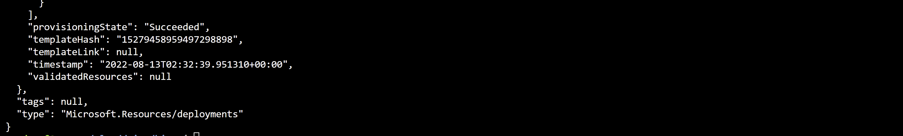
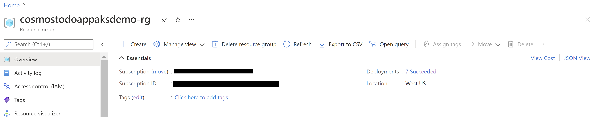

# AKS Cluster, Cosmos DB, Key Vault, and ACR using Bicep

## Overview

This repo explains on how to use modular approach for Infrastructure as Code to provision a AKS cluster and few related resources. The AKS is configured to run a Sample Todo App where access control is manged using RBAC and Managed Identity. The bicep modules in the repository are designed keeping Base line architecture in mind. You can start using these modules as is or modify to suit the needs.

The bicep modules will provision the following Azure Resources under subscription scope.

1. A Resource Group with Baseline variable
2. A Managed Identity
3. An Azure Container Registry for storing images
4. A VNet required for configuring the AKS
5. An AKS Cluster with monitoring Addon
6. A Cosmos DB SQL API Account along with a Database, Container, and SQL Role to manage RBAC
7. A Key Vault to store secure keys
8. A Log Analytics Workspace

## Deploy infrastructure with bicep

1. Clone the repo
Clone the repo and move to Bicep folder

```azurecli
cd Bicep
```

2. Login to your Azure Account

```azurecli
az login

az account set -s <Subscription ID>
```


3. Initialize Parameters

Create a param.json file by using the following JSON, using your own values for Resource Group Name, Cosmos DB Account Name, and Azure Container Registry instance Name. Refer to [Naming rules and restrictions for Azure resources] (https://docs.microsoft.com/en-us/azure/azure-resource-manager/management/resource-name-rules).

```json
{
  "$schema": "https://schema.management.azure.com/schemas/2019-04-01/deploymentParameters.json#",
  "contentVersion": "1.0.0.0",
  "parameters": {
    "baseName": {
      "value": "{Resource Group Name}"
    },    
    "cosmosName" :{
      "value": "{Cosmos DB Account Name}"
    },
    "acrName" :{
      "value": "{ACR Instance Name}"
    }
  }
}
```

4. Run Deployment

Run the following script to create the deployment 

```azurecli
baseline='{Deployment Name}'  # Deployment Name
location='{Location}' # Location for deploying the resources

az deployment sub create --name $baseline --location $location --template-file main.bicep --parameters @param.json
```


The deployment could take somewhere around 20 to 30 mins. Once provisioning is completed you should see a JSON output with Succeeded as provisioning state.



You can also see the deployment status in the Resource Group



5. Link Azure Container Registry with AKS

Integrate the ACR with the AKS cluster by supplying valid ACR name

```azurecli
# ensure the below value matches  the acrName field of param.json
acrName=$baseline'acr' 

az aks update -n $baseline'aks' -g $baseline'-rg' --attach-acr $acrName
```

6. Sign in to AKS CLuster

Use [az aks get-credentials][az-aks-get-credentials] to sign in to your AKS cluster. This command also downloads and configures the kubectl client certificate on your development computer.

```azurecli
# az aks get-credentials -n $baseline'aks' -g $baseline'-rg'
```

7. Enable the AKS Pods to connect to Key Vault

Azure Active Directory (Azure AD) pod-managed identities use AKS primitives to associate managed identities for Azure resources and identities in Azure AD with pods. You can use these identities to grant access to the Azure Key Vault Secrets Provider for Secrets Store CSI driver.

Using the following YAML template create a secretproviderclass.yml. Make sure to update your own values for Tenant Id and Kev Vault Name.

```yml
# This is a SecretProviderClass example using aad-pod-identity to access the key vault
apiVersion: secrets-store.csi.x-k8s.io/v1
kind: SecretProviderClass
metadata:
  name: azure-kvname-podid
spec:
  provider: azure
  parameters:
    usePodIdentity: "true"               
    keyvaultName: "{Key Vault Name}"       # Set to the name of your key vault
    cloudName: ""                        
    objects:  |
      array:
        - |
          objectName: secret1
          objectType: secret            
          objectVersion: ""              
        - |
          objectName: key1
          objectType: key
          objectVersion: ""
    tenantId: "{Tenant Id}"              # The tenant ID of the key vault
```

8. Apply the SecretProviderClass to your cluster

The following command installs the Secrets Store CSI Driver using the YAML. 

```azurecli
kubectl apply -f secretproviderclass.yaml
```

9. Push the container image to Azure Container Registry

Using Visual Studio build the application source code available in the Application folder, [publish the container image to the ACR] (https://docs.microsoft.com/en-us/visualstudio/containers/hosting-web-apps-in-docker?view=vs-2022).

10. Prepare Deployment YAML

Using the following YAML template create a akstododeploy.yml file. Make sure to replace the values for ACR Name, Image Name, Version and KeyVault Name

```yml
apiVersion: apps/v1
kind: Deployment
metadata:
  name: todo
  labels:
    aadpodidbinding: "my-pod-identity"
    app: todo
spec:
  replicas: 2
  selector:
    matchLabels:
      app: todo
  template:
    metadata:
      labels:
        app: todo
        aadpodidbinding: "my-pod-identity"
    spec:
      containers:
      - name: mycontainer
        image: "{ACR Name}/{Image Name}:{Version}"   # update as per your environment, example myacrname.azurecr.io/todo:latest
        ports:
        - containerPort: 80
        env:
        - name: KeyVaultName
          value: "{Key Vault Name}" # update as per your environment
      nodeSelector:
        kubernetes.io/os: linux
      volumes:
        - name: secrets-store01-inline
          csi:
            driver: secrets-store.csi.k8s.io
            readOnly: true
            volumeAttributes:
              secretProviderClass: "azure-kvname-podid"       
---
    
kind: Service
apiVersion: v1
metadata:
  name: todo
spec:
  selector:
    app: todo
    aadpodidbinding: "my-pod-identity"    
  type: LoadBalancer
  ports:
  - protocol: TCP
    port: 80
    targetPort: 80
``` 

11. Apply Deployment YAML

The following command deploys the application pods and exposes the pods via a load balancer.

```azurecli
kubectl apply -f akstododeploy.yml --namespace 'my-app'
```

12. Access the deployed application

Run the following command to view the external IP exposed by the load balancer

```azurecli
kubectl get services --namespace "my-app"
```

Open the IP received as output in a browser to access the application.

# Cleanup

Use the below commands to delete the Resource Group and Deployment

```azurecli
az group delete -g $baseline'-rg' -y
az deployment sub delete -n $baseline
```
