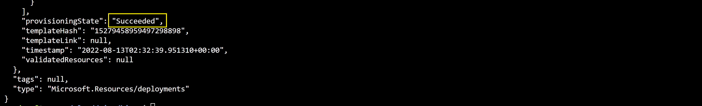
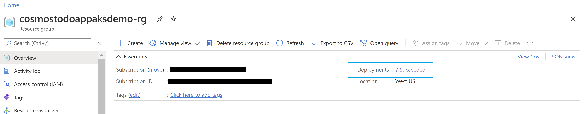

# AKS Cluster, Cosmos DB, Key Vault, and ACR using Bicep

## Overview

This repository explains on how to use modular approach for Infrastructure as Code to provision a AKS cluster and few related resources. The AKS is configured to run a Sample Todo App where access control is manged using RBAC and Managed Identity.

The [Bicep](https://docs.microsoft.com/azure/azure-resource-manager/bicep/overview?tabs=bicep) modules in the repository are designed keeping baseline architecture in mind. You can start using these modules as is or modify to suit the needs.

The Bicep modules will provision the following Azure Resources under subscription scope.

1. A Resource Group
2. A Managed Identity
3. An Azure Container Registry for storing images
4. A VNet required for configuring the AKS
5. An AKS Cluster
6. A Cosmos DB SQL API Account along with a Database, Container, and SQL Role to manage RBAC
7. A Key Vault to store secure keys
8. A Log Analytics Workspace (optional)

### Architecture


### Securing the Cosmos DB account

You can configure the Azure Cosmos DB account to:

1. Allow access only from a specific subnet of a virtual network (VNET) **or** make it accessible from any source.
2. Authorize request accompanied by a valid authorization token **or** restrict access using RBAC and Managed Identity.

This deployment uses the following best practices to enhance security of the Azure Cosmos DB account

1. Limits access to the subnet by [configuring a virtual network service endpoint](https://docs.microsoft.com/azure/cosmos-db/how-to-configure-vnet-service-endpoint).
2. Set disableLocalAuth = true in the databaseAccount resource to [enforce RBAC as the only authentication method](https://docs.microsoft.com//azure/cosmos-db/how-to-setup-rbac#disable-local-auth).

Refer to the comments in *Bicep\modules\cosmos\cosmos.bicep*, and *Bicep\modules\vnet\vnet.bicep* files and edit these files as required to remove the above mentioned restrictions.

## Deploy infrastructure with Bicep

**1. Clone the repository**

Clone the repository and move to Bicep folder

```azurecli
cd Bicep
```

**2. Login to your Azure Account**

```azurecli
az login

az account set -s <Subscription ID>
```


**3. Initialize Parameters**

Create a param.json file by using the following JSON, replace the {Resource Group Name}, {Cosmos DB Account Name}, and {ACR Instance Name} placeholders with your own values for Resource Group Name, Cosmos DB Account Name, and Azure Container Registry instance Name. Refer to [Naming rules and restrictions for Azure resources](https://docs.microsoft.com/azure/azure-resource-manager/management/resource-name-rules).

```json
{
  "$schema": "https://schema.management.azure.com/schemas/2019-04-01/deploymentParameters.json#",
  "contentVersion": "1.0.0.0",
  "parameters": {
    "rgName": {
      "value": "{Resource Group Name}"
    },    
    "cosmosName" :{
      "value": "{Cosmos DB Account Name}"
    },
    "acrName" :{
      "value": "{ACR Instance Name}"
    }
  }
}
```

**4. Run Deployment**

Run the following script to create the deployment

```azurecli
deploymentName='{Deployment Name}'  # Deployment Name
location='{Location}' # Location for deploying the resources

az deployment sub create --name $deploymentName --location $location --template-file main.bicep --parameters @param.json
```


The deployment could take somewhere around 20 to 30 mins. Once provisioning is completed you should see a JSON output with Succeeded as provisioning state.



You can also see the deployment status in the Resource Group



**5. Link Azure Container Registry with AKS**

Set the environment variables by replacing the {ACR Instance Name}, {Resource Group Name}, and {AKS Cluster Name} placeholders with your own values. The names should be compliant with [Naming rules and restrictions for Azure resources](https://docs.microsoft.com/azure/azure-resource-manager/management/resource-name-rules), also ensure that the below values for {ACR Instance Name} and {Resource Group Name} placeholders match with values supplied in param.json.

```azurecli

acrName='{ACR Instance Name}'
rgName='{Resource Group Name}'

```

Run the below command to integrate the ACR with the AKS cluster

```azurecli
aksName=$rgName'aks'
az aks update -n $aksName -g $rgName --attach-acr $acrName
```

**6. Sign in to AKS CLuster**

Use the below command to sign in to your AKS cluster. This command also downloads and configures the kubectl client certificate on your environment.

```azurecli
az aks get-credentials -n $aksName -g $rgName
```

**7. Enable the AKS Pods to connect to Key Vault**

Azure Active Directory (Azure AD) pod-managed identities use AKS primitives to associate managed identities for Azure resources and identities in Azure AD with pods. You can use these identities to grant access to the Azure Key Vault Secrets Provider for Secrets Store CSI driver.

First, find the values of your  Tenant ID (homeTenantId) using the command below:
```azurecli
az account show
```

Using the following YAML template create a secretproviderclass.yml. Make sure to update your own values for {Tenant Id} and {Resource Group Name} placeholders. Ensure that the below values for {Resource Group Name} placeholder matches with values supplied in param.json.

```yml
# This is a SecretProviderClass example using aad-pod-identity to access the key vault
apiVersion: secrets-store.csi.x-k8s.io/v1
kind: SecretProviderClass
metadata:
  name: azure-kvname-podid
spec:
  provider: azure
  parameters:
    usePodIdentity: "true"               
    keyvaultName: "{Resource Group Name}kv"       # Replace resource group name. Key Vault name is generated by Bicep
    cloudName: ""                        
    objects:  |
      array:
        - |
          objectName: secret1
          objectType: secret            
          objectVersion: ""              
        - |
          objectName: key1
          objectType: key
          objectVersion: ""
    tenantId: "{Tenant Id}"              # The tenant ID of your account, use 'homeTenantId' attribute value from  the 'az account show' command output
```

**8. Apply the SecretProviderClass to your cluster**

The following command installs the Secrets Store CSI Driver using the YAML. 

```azurecli
kubectl apply -f secretproviderclass.yml
```

**9. Push the container image to Azure Container Registry**

The application can be built and pushed to ACR using Visual Studio or VS Code, use any of the two methods given below
**Using Visual Studio**

Prerequisites: 
* [Docker Desktop](https://docs.docker.com/desktop/)
* [Visual Studio 2022](https://visualstudio.microsoft.com/downloads) with the Web Development, Azure Tools workload, and/or .NET Core cross-platform development workload installed
* [.NET Core Development Tools](https://dotnet.microsoft.com/download/dotnet-core/) for development with .NET Core


Build the application source code available in the Application folder, and then [publish the container image to the ACR](https://docs.microsoft.com/visualstudio/containers/hosting-web-apps-in-docker?view=vs-2022).

**Using Visual Studio Code**

Prerequisites:
* [Docker Desktop](https://docs.docker.com/desktop/)
* [Visual Studio Code](https://code.visualstudio.com/)
* [C# for Visual Studio Code](https://marketplace.visualstudio.com/items?itemName=ms-dotnettools.csharp)
* [Docker extension for Visual Studio Code](https://code.visualstudio.com/docs/containers/overview)
* [Azure Account extension for Visual Studio Code](https://marketplace.visualstudio.com/items?itemName=ms-vscode.azure-account)

    1. To build the code, open the Application folder in VS code. Select Yes to the warning message to add the missing build and debug assets. Pressing the F5 button to run the application.

    2. To create a container image from the Explorer tab on VS Code, right click on the Dokcerfile and select BuildImage. You will then get a prompt asking for the name and version to tag the image. Type todo:latest.

        

    3. To push the built image to ACR open the Docker tab.You will find the built image under the Images node. Open the todo node, right-click on latest and select "Push...". You will then get prompts to select your Azure Subscription, ACR, and Image tag. Image tag format should be {acrname}.azurecr.io/todo:latest.

        

    4. Wait for VS Code  to push the  image to ACR.

**10. Prepare Deployment YAML**

Using the following YAML template create a akstododeploy.yml file. Make sure to replace the values for {ACR Name}, {Image Name}, {Version}, and {Resource Group Name} placeholders.

```yml
apiVersion: apps/v1
kind: Deployment
metadata:
  name: todo
  labels:
    aadpodidbinding: "cosmostodo-apppodidentity"
    app: todo
spec:
  replicas: 2
  selector:
    matchLabels:
      app: todo
  template:
    metadata:
      labels:
        app: todo
        aadpodidbinding: "cosmostodo-apppodidentity"
    spec:
      containers:
      - name: mycontainer
        image: "{ACR Name}/{Image Name}:{Version}"   # update as per your environment, example myacrname.azurecr.io/todo:latest. Do NOT add https:// in ACR Name
        ports:
        - containerPort: 80
        env:
        - name: KeyVaultName
          value: "{Resource Group Name}kv"       # Replace resource group name. Key Vault name is generated by Bicep
      nodeSelector:
        kubernetes.io/os: linux
      volumes:
        - name: secrets-store01-inline
          csi:
            driver: secrets-store.csi.k8s.io
            readOnly: true
            volumeAttributes:
              secretProviderClass: "azure-kvname-podid"       
---
    
kind: Service
apiVersion: v1
metadata:
  name: todo
spec:
  selector:
    app: todo
    aadpodidbinding: "cosmostodo-apppodidentity"    
  type: LoadBalancer
  ports:
  - protocol: TCP
    port: 80
    targetPort: 80
``` 

**11. Apply Deployment YAML**

The following command deploys the application pods and exposes the pods via a load balancer.

```azurecli
kubectl apply -f akstododeploy.yml --namespace 'my-app'
```

**12. Access the deployed application**

Run the following command to view the external IP exposed by the load balancer

```azurecli
kubectl get services --namespace "my-app"
```

Open the IP received as output in a browser to access the application.

## Cleanup

Use the below commands to delete the Resource Group and Deployment

```azurecli
az group delete -g $rgName -y
az deployment sub delete -n $deploymentName
```
