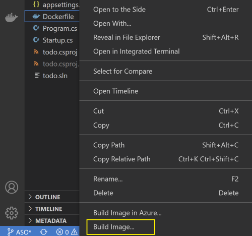

# AKS Cluster, Cosmos DB, Key Vault, and ACR using Terraform

## Overview

This repository demonstrates how to use Terraform for Infrastructure as Code to provision a AKS cluster and few related resources. The AKS is configured to run a Sample Todo App where access control is managed using RBAC and Managed Identity.

The [Terraform](https://developer.hashicorp.com/terraform/tutorials/azure-get-started/infrastructure-as-code) code in the repository are designed keeping baseline architecture in mind. You can start using them as is or modify to suit your needs.

The Terraform code will provision the following Azure Resources under a specified subscription scope.

1. A Resource Group
2. A Managed Identity
3. An Azure Container Registry for storing images
4. A VNet required for configuring the AKS
5. An AKS Cluster
6. A Cosmos DB SQL API Account along with a Database, Container, and SQL Role to manage RBAC
7. A Key Vault to store secure keys

### Architecture


### Securing the Cosmos DB account

You can configure the Azure Cosmos DB account to:

1. Allow access only from a specific subnet of a virtual network (VNET) **or** make it accessible from any source.
2. Authorize request accompanied by a valid authorization token **or** restrict access using RBAC and Managed Identity.

This deployment uses the following best practices to enhance security of the Azure Cosmos DB account

1. Limits access to the subnet by [configuring a virtual network service endpoint](https://docs.microsoft.com/azure/cosmos-db/how-to-configure-vnet-service-endpoint).
2. Set disableLocalAuth = true in the databaseAccount resource to [enforce RBAC as the only authentication method](https://docs.microsoft.com//azure/cosmos-db/how-to-setup-rbac#disable-local-auth).

Refer to the comments in *cosmosdb.tf*, and *vnet.tf* files and edit these files as required to remove the above mentioned restrictions.

## Deploy infrastructure with Bicep

**1. Clone the repository**

Clone the repository and move to Bicep folder

```bash
cd Terraform
```

**2. Login to your Azure Account**

```bash
az login

az account set -s <Subscription ID>
```


**3. Initialize Parameters**

Create a terraform.tfvars file that contains the following parameters. Replace the below placeholders with your own values. Refer to [Naming rules and restrictions for Azure resources](https://docs.microsoft.com/azure/azure-resource-manager/management/resource-name-rules) for guidance.
```yaml
rg_name  = "{Resource group name}"
location = "{Region}"
acr_name = "{Container Registry Name}"
cosmosdb_account_name = "{Cosmos DB Account Name}"
aks_name = "{AKS Name}"
kv_name = "{Key Vault Name}"
```

**4. Run Deployment**

Run the following script to create the deployment

```bash
terraform init 
terraform plan
terraform apply --auto-approve 
```


The deployment could take somewhere around 20 to 30 mins. Once provisioning is completed you should see a resourace outputs with Succeeded provisioning state.


You can also see the deployment status in the Resource Group


**5. Sign in to AKS CLuster**

Use the below command to sign in to your AKS cluster. This command also downloads and configures the kubectl client certificate on your environment.

```azurecli
az aks get-credentials -n $aksName -g $rgName
```

**6. Enable the AKS Pods to connect to Key Vault**

Azure Active Directory (Azure AD) pod-managed identities use AKS primitives to associate managed identities for Azure resources and identities in Azure AD with pods. You can use these identities to grant access to the Azure Key Vault Secrets Provider for Secrets Store CSI driver.

First, find the values of your  Tenant ID (homeTenantId) using the command below:
```azurecli
az account show
```

Using the following YAML template create a secretproviderclass.yml. Make sure to update your own values for {Tenant Id} and {Resource Group Name} placeholders. Ensure that the below values for {Resource Group Name} placeholder matches with values supplied in param.json.

```yml
# This is a SecretProviderClass example using workloads identity to access the key vault
apiVersion: secrets-store.csi.x-k8s.io/v1
kind: SecretProviderClass
metadata:
  name: ${secret-provider-name} # needs to be unique per namespace
spec:
  provider: azure
  parameters:
    usePodIdentity: "false"
    useVMManagedIdentity: "false"          
    clientID: "${user-assigned-identity-client-id}" # Setting this to use workload identity
    keyvaultName: "${key-vault-name}"       # Set to the name of your key vault
    cloudName: "AzurePublicCloud"                         # [OPTIONAL for Azure] if not provided, the Azure environment defaults to AzurePublicCloud
    objects:  |
      array:
        - |
          objectName: secret1
          objectType: secret              # object types: secret, key, or cert
          objectVersion: ""               # [OPTIONAL] object versions, default to latest if empty
        - |
          objectName: key1
          objectType: key
          objectVersion: ""
    tenantId: "${your-tenant-id}"        # The tenant ID of the key vault
```

**7. Apply the SecretProviderClass to your cluster**

The following command installs the Secrets Store CSI Driver using the YAML. 

```azurecli
kubectl apply -f secretproviderclass.yml
```

**8. Push the container image to Azure Container Registry**

The application can be built and pushed to ACR using Visual Studio or VS Code, use any of the two methods given below
**Using Visual Studio**

Prerequisites: 
* [Docker Desktop](https://docs.docker.com/desktop/)
* [Visual Studio 2022](https://visualstudio.microsoft.com/downloads) with the Web Development, Azure Tools workload, and/or .NET Core cross-platform development workload installed
* [.NET Core Development Tools](https://dotnet.microsoft.com/download/dotnet-core/) for development with .NET Core


Build the application source code available in the Application folder, and then [publish the container image to the ACR](https://docs.microsoft.com/visualstudio/containers/hosting-web-apps-in-docker?view=vs-2022).

**Using Visual Studio Code**

Prerequisites:
* [Docker Desktop](https://docs.docker.com/desktop/)
* [Visual Studio Code](https://code.visualstudio.com/)
* [C# for Visual Studio Code](https://marketplace.visualstudio.com/items?itemName=ms-dotnettools.csharp)
* [Docker extension for Visual Studio Code](https://code.visualstudio.com/docs/containers/overview)
* [Azure Account extension for Visual Studio Code](https://marketplace.visualstudio.com/items?itemName=ms-vscode.azure-account)

    1. To build the code, open the Application folder in VS code. Select Yes to the warning message to add the missing build and debug assets. Pressing the F5 button to run the application.

    2. To create a container image from the Explorer tab on VS Code, right click on the Dokcerfile and select BuildImage. You will then get a prompt asking for the name and version to tag the image. Type todo:latest.

        

    3. To push the built image to ACR open the Docker tab.You will find the built image under the Images node. Open the todo node, right-click on latest and select "Push...". You will then get prompts to select your Azure Subscription, ACR, and Image tag. Image tag format should be {acrname}.azurecr.io/todo:latest.

        

    4. Wait for VS Code  to push the  image to ACR.

**10. Prepare Deployment YAML**

Using the following YAML template create a akstododeploy.yml file. Make sure to replace the values for {ACR Name}, {Image Name}, {Version}, and {Resource Group Name} placeholders.

```yml
apiVersion: apps/v1
kind: Deployment
metadata:
  name: todo
  labels:
    app: todo
spec:
  replicas: 2
  selector:
    matchLabels:
      app: todo
  template:
    metadata:
      labels:
        app: todo
        azure.workload.identity/use: "true"
    spec:
      serviceAccountName: "workload-identity-sa" #referenced in federated identity object
      containers:
      - name: mycontainer
        image: "{your-acr-name}.azurecr.io/{image}:{version}"   # update as per your environment, example myacrname.azurecr.io/todo:latest. Do NOT add https:// in ACR Name
        ports:
        - containerPort: 80
        env:
        - name: KeyVaultName
          value: "{your-key-vault-name}"     
      nodeSelector:
        kubernetes.io/os: linux
      volumes:
        - name: secrets-store01-inline
          csi:
            driver: secrets-store.csi.k8s.io
            readOnly: true
            volumeAttributes:
              secretProviderClass: "azure-kv-workload-identity" # should match secretproviderclass name
---
    
apiVersion: v1
kind: ServiceAccount
metadata:
  annotations:
    azure.workload.identity/client-id: "{your-user-assigned-identity-clientid}"
  labels:
    azure.workload.identity/use: "true"
  name: "workload-identity-sa"
  namespace: "default"

--- 

kind: Service
apiVersion: v1
metadata:
  name: todo
spec:
  selector:
    app: todo
  type: LoadBalancer
  ports:
  - protocol: TCP
    port: 80
    targetPort: 80
``` 

**11. Apply Deployment YAML**

The following command deploys the application pods and exposes the pods via a load balancer.

```azurecli
kubectl apply -f akstododeploy.yml --namespace 'default'
```

**12. Access the deployed application**

Run the following command to view the external IP exposed by the load balancer

```azurecli
kubectl get services --namespace 'default'
```

Open the IP received as output in a browser to access the application.

## Cleanup

Use the below commands to delete the environment.

```bash
terraform destroy
```
